### 七麦数据榜单数据爬取

发现榜单数据为XHR类型请求响应，并且存在加密参数；

经过测试发现有两个个参数在多次请求中不断发生变化：

analysis参数和genre参数，其中analysis为加密参数，genre为分类参数，不同类别的榜单，分别为不同类别的固定参数：

> 总榜：genre：36
>
> 应用：genre：5000
>
> 游戏：genre：6014

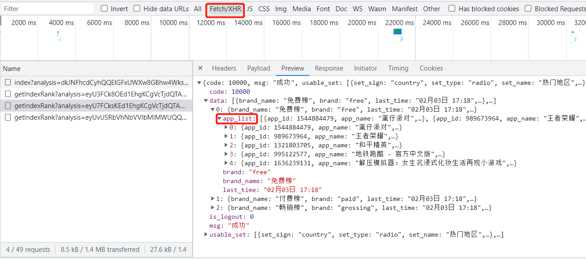

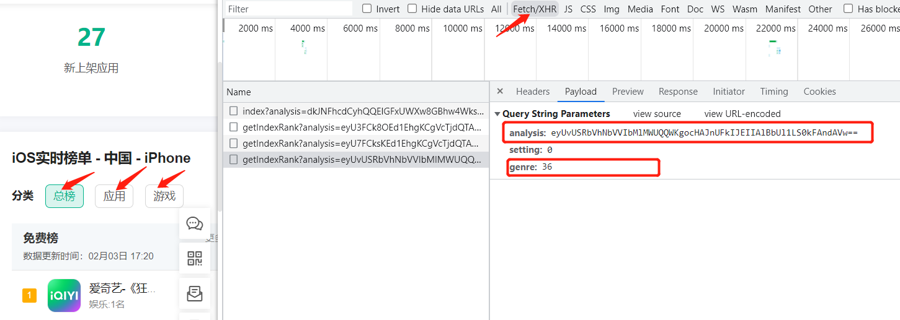

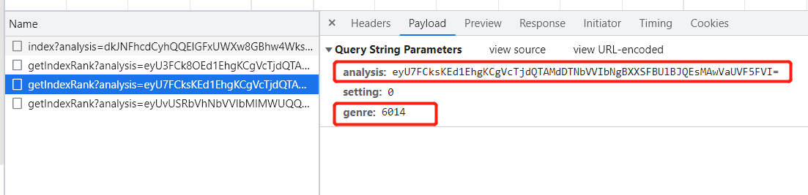

直接全局搜索，发现没有搜到任何数据

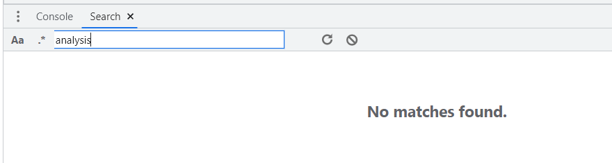

直接使用XHR断点，刷新网页让代码断在包含analysis参数的地方。

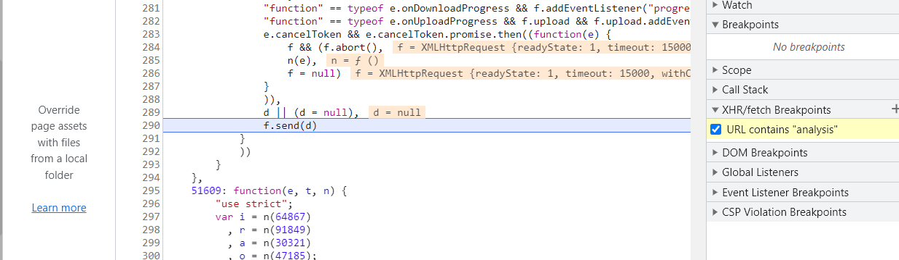

发现请求拦截器和响应拦截器函数

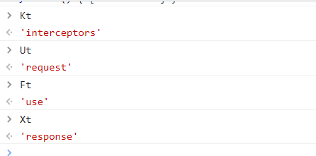

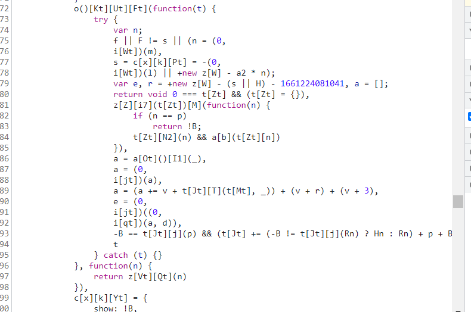

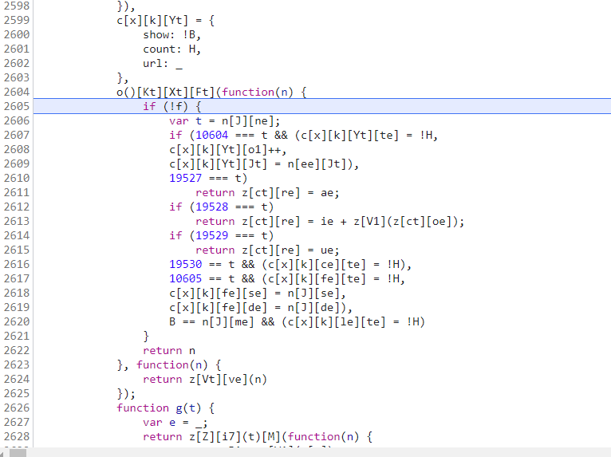

在请求拦截器中，最终发现e变量生成了analysis参数值。

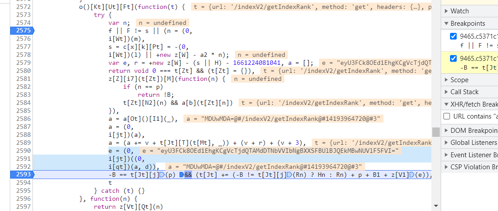

函数化简之后：

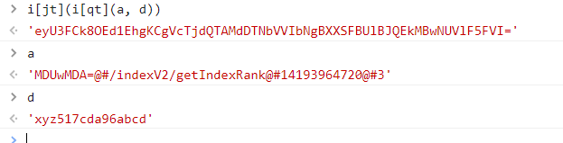

可分解为两个函数过程：

```
param = i[qt](a, d)
analysis = i[jt](param)
# 破解完这两个函数后，继续破解a，d两个参数，即可最终得到analysis参数
```

进行一系列参数逆向之后即可破解，破解过程和代码见：

> JS逆向-七麦数据.js

构造请求访问数据过程和代码见：

> JS逆向-七麦数据.py

最终数据被成功取出

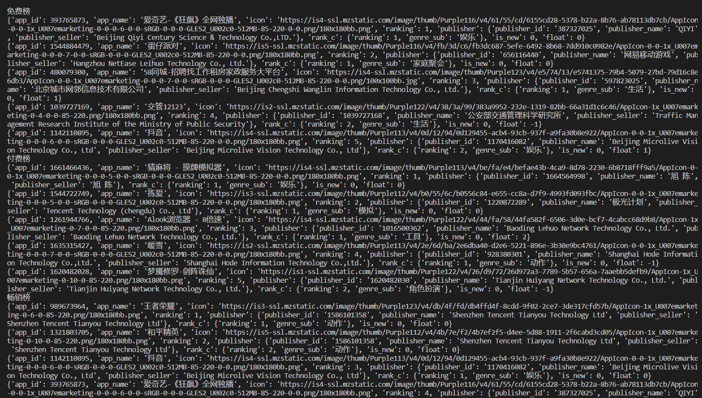