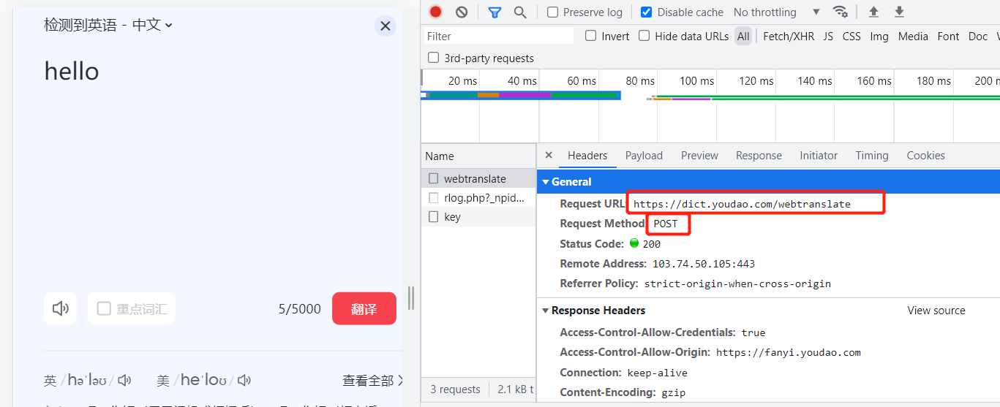
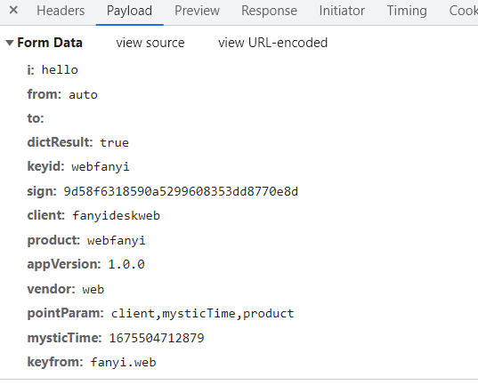
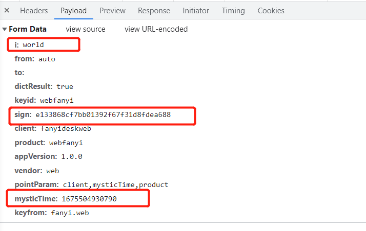
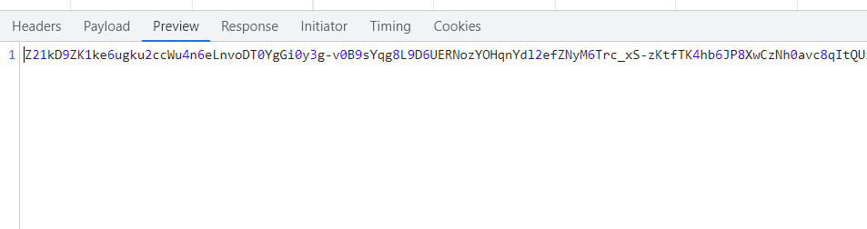
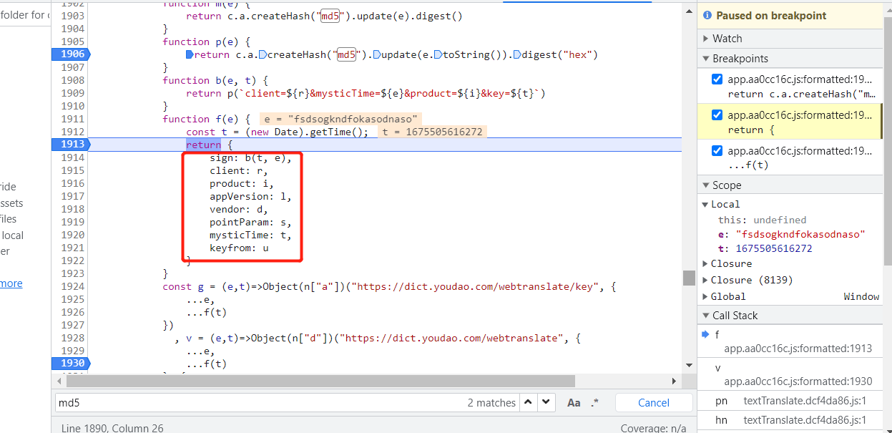

### 有道翻译逆向

目标网址：https://fanyi.youdao.com/index.html#/

最终实现代码文本输入到文本输出

需要破解的部分：

> sign参数
>
> mysticTime参数
>
> 返回的密文进行解密

#### 解析过程

抓包发现请求接口，请求使用的POST请求

请求参数如下

对比两次请求所传递的参数，可以看出有三个参数发生了变化

其中i表示的是输入文本，sign是一个加密，根据经验判断可能是md5

mysticTime参数应该是一个时间戳

另外，请求返回值也是密文

接下来通过XHR断点和加密函数搜索去寻找其加密过程JS函数

